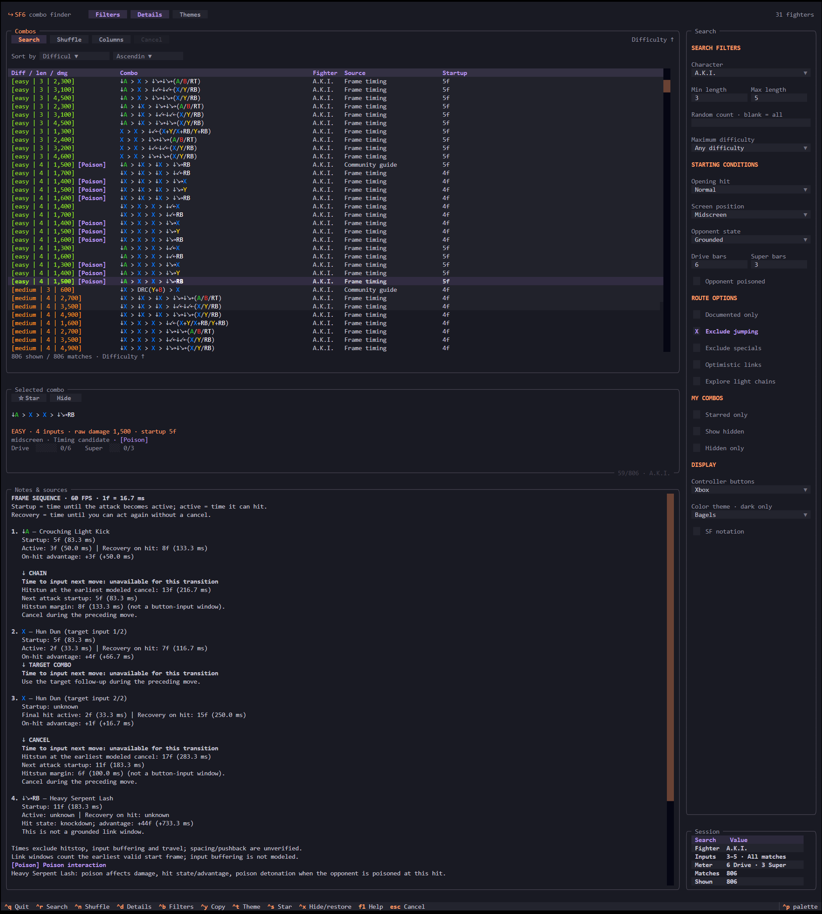

# SF6 Combo Finder

Find Street Fighter 6 routes to practice in a terminal app. Browse 31 fighters,
filter by length, difficulty and meter, and inspect each move's frame timing.
Save favorites, hide unwanted routes, and shuffle through matching combos.

## Install and launch

### Release download

If a build is available for your platform on the [Releases page](https://github.com/fishxsea/SF6_combo_finder/releases),
download and extract the entire ZIP. Keep the `_internal` folder beside the executable.

- **Windows:** open `sf-combo-finder.exe`.
- **macOS:** open `Start SF Combo Finder.command`.
- **Linux:** run `./sf-combo-finder` in a terminal.

Release builds do not require Python.

### Run from source

Requires **Python 3.10 or newer**. Download or clone this repository, then open
a terminal in the project folder.

**Windows (PowerShell):**

```powershell
py -3 -m venv .venv
.\.venv\Scripts\python.exe -m pip install .
.\.venv\Scripts\sf-combo-finder.exe
```

**macOS / Linux:**

```bash
python3 -m venv .venv
.venv/bin/python -m pip install .
.venv/bin/sf-combo-finder
```

To launch again, repeat only the last command for your platform.

## Using the app

1. Open **Filters** and choose a fighter, input-length range, difficulty and meter.
   Set the opening hit and screen position as needed. **Any position** includes
   both midscreen and corner recipes.
2. Press **Search**. Start with short routes; longer searches take more time.
3. Select a row and press **Enter**, or click **Details**, to see the vertical
   move sequence, frame timings, input windows in milliseconds, and source notes.
4. Set **Random count** and press **Shuffle** for another sample from cached matches.
   A blank count shows all matches on Search; Shuffle defaults to 25.
5. **Star** saves a favorite. **Hide** removes a route from normal results.
   Use **Starred only**, **Show hidden**, or **Hidden only** to review saved routes.

**Columns** lets you choose what the table shows. The defaults are **Diff / len / dmg**,
**Combo**, **Fighter**, **Source**, and **Startup**. Your layout is saved.

Route-option checkboxes reuse cached results after the first search. Changing the
fighter, length, meter or starting conditions can require a new search.

Choose **Xbox**, **PlayStation**, or **SF notation** under Display. Button labels
assume Classic controls. Themes and display choices are saved automatically.

### A.K.I. poison

**Opponent poisoned** appears when A.K.I. is selected. It updates poison-dependent
damage and follow-ups using prepared result pools. A **[Poison]** badge means the
route has a poison interaction; it does not always require starting poisoned.

## Reading the results

- **Length** counts move inputs, including movement and target-combo inputs.
- **Damage** is the raw total before combo scaling and poison damage over time.
- **Difficulty** is an estimate that includes tight nominal link timing.
- **Startup** is the opening attack's startup, excluding movement and charge preparation.
- **Source** distinguishes published recipes from generated timing candidates.
  **[Corner]** and optional setup columns show recorded requirements. Prefixes
  inherit their recipe's setup and may also work elsewhere.

Check routes in training mode. Coverage is incomplete, older recipes may differ
on the current patch, and generated routes do not simulate hitboxes or pushback.
Link windows come from frame advantage; exact buffered input windows are not measured.

## Keyboard controls

| Key | Action |
| --- | --- |
| Tab / Shift+Tab | Move between controls |
| Arrow keys / Enter | Select a combo / open details |
| Ctrl+R / Ctrl+N | Search / Shuffle |
| Ctrl+B / Ctrl+D | Toggle Filters / Details |
| Ctrl+S / Ctrl+X | Star / Hide or restore |
| Ctrl+Y | Copy the selected combo (terminal support required) |
| Escape / Ctrl+Q | Cancel a search / Quit |
| F1 | Full in-app help |

## Command line

With the Windows source setup above:

```powershell
.\.venv\Scripts\sf-combo-finder-cli.exe ryu --random 5
.\.venv\Scripts\sf-combo-finder-cli.exe aki --documented-only --position corner --max-length 8
.\.venv\Scripts\sf-combo-finder-cli.exe --help
```

On macOS/Linux, use `.venv/bin/sf-combo-finder-cli` instead.
Release executables accept `--cli` to use this mode.

## Data and search rules

See [search rules](COMBO_RULES.md), [combo coverage](DOCUMENTED_COVERAGE.md),
and [data sources](DATA_SOURCES.md) for technical details.
Imported frame data is credited to SF6 Sensei and SuperCombo Wiki;
see [attribution and licensing](DATA_NOTICE.md).


